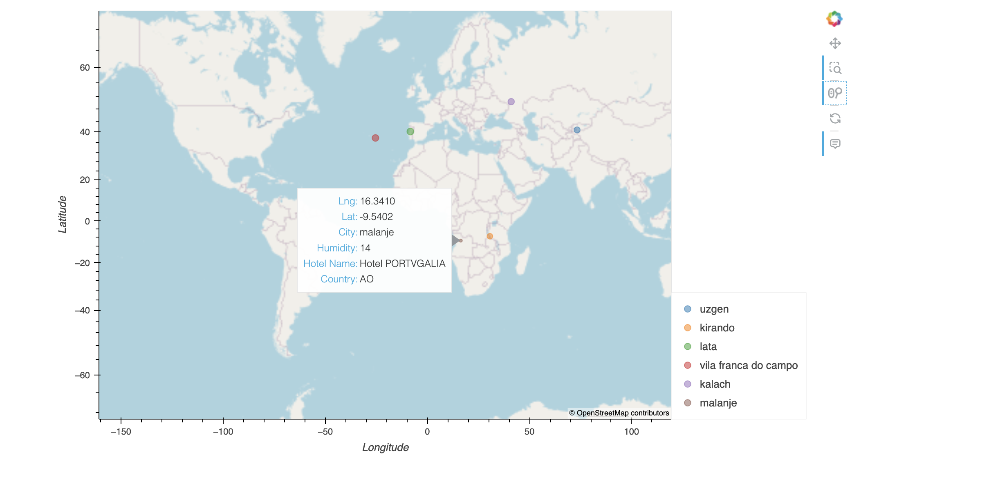

# Pythong-API-Analysis

## Website: 
[website](https://github.com/mrslinton/python-api-analysis)

## Description
Randomly selected over 500 cities across the globe to analyze weather conditions based on latitude, we now can confirm that there is a correlation between temperatures and latitude. In addition, we searched for hotels using the geopy API to find hotels in cities with ideal weather conditions.

## Table of Contents
- [Installation](#installation)
- [Usage](#usage)
- [Credits](#credits)
- [License](#license)
- [Features](#features)

- [Contact](#contact)

## Installation
Python, geoview, pyproj, open weather map, geoapify, hvplot, matplotlib, cartopy

## Usage
Run the jupyter notebook files, add your own API keys for open weather map and geoapify

## Credits
Jennifer Harris

## License
MIT

## Features
Tables, maps, bar charts, scatter plots

## Contact
If there are any questions of concerns, I can be reached at:
##### [github: mrslinton](https://github.com/mrslinton)
##### [email: jennifer.v.harris@outlook.com](mailto:jennifer.v.harris@outlook.com)
